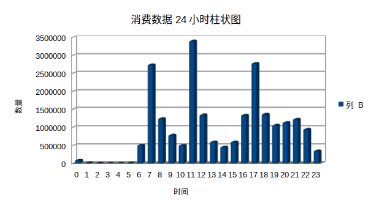

# 消费地点：
## 浴室
西山浴室
开发区浴室
北山B区浴室
北山浴室
## 电网费
圈存缴网费
电子缴电费
开发区网络计费
开发区智能控电
## 热水器
西山热水器
京鹤直饮水
开发区开水机
北山AB区热水器
北山C区热水器
## 体育馆
体育馆
软件学院体育馆
北山体育馆
## 食堂
中心食堂一层
五食堂一层
中心食堂二层
中心食堂三层
开发区校区食堂
五食堂二层
沁园餐厅
五食堂三层
中心食堂清真
七食堂1楼
七食堂2楼
九食堂清真餐厅
盘锦校区B12食堂
盘锦校区B13食堂
专招食堂
第十食堂
九食堂三楼
中心食堂四层
## 超市
大学生超市
十食堂超市
## 洗衣机
卢工洗衣机
郭顺发洗衣机
赵工洗衣机
梁工洗衣机
## 书店
教育书店咖啡厅
图书馆POS
图书馆机房管理系统
## 其他
机房管理商户
校医院
班车
博留一层
教务注册大厅收费
汇文系统
校友工作处
建艺学院
博留咖啡厅
本科生图像采集
英语四六级
自助补卡收卡成本
自助打印
服务大厅
开发区机房系统
## 判断是否在食堂：关键词有无食堂
# 消费数据24小时分布
        0	89441
        1	18835
        2	6502
        3	3571
        4	3475
        5	13507
        6	508210
        7	2741620
        8	1249543
        9	788957
        10	505116
        11	3401983
        12	1351557
        13	598944
        14	458036
        15	600696
        16	1343187
        17	2782150
        18	1369980
        19	1064263
        20	1137947
        21	1229559
        22	951971
        23	349753
# 消费数据月份
2017	2
2018	1
2018	2
2018	3
2018	4
2018	5
2018	6
2018	7
2018	8
2018	9
2018	10
2018	11
2018	12
2019	1
2019	2
2019	3
2019	4
2019	5
2020	1
## 柱状图：
