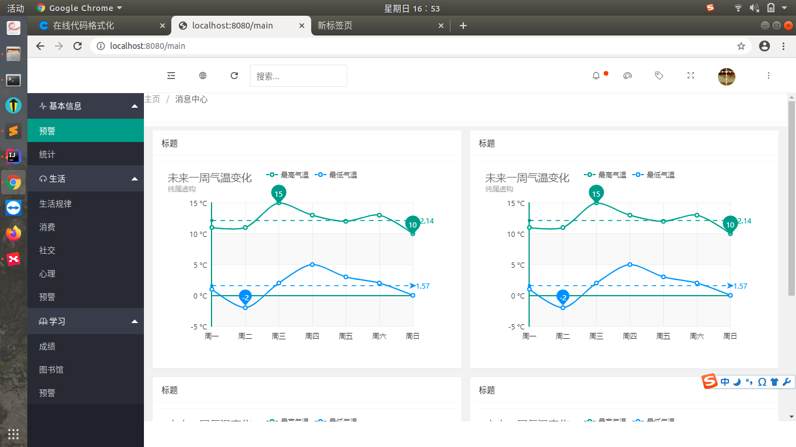
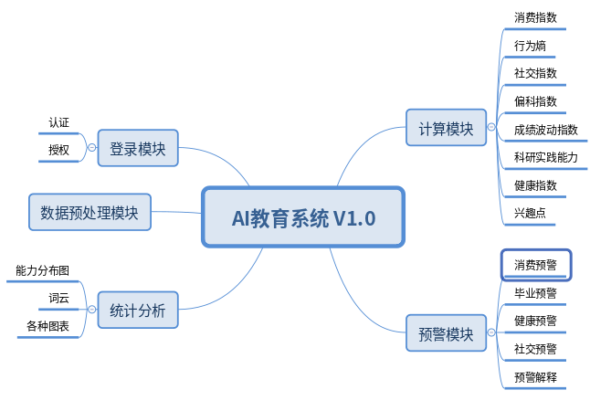
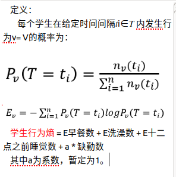
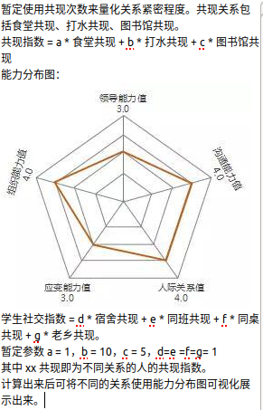
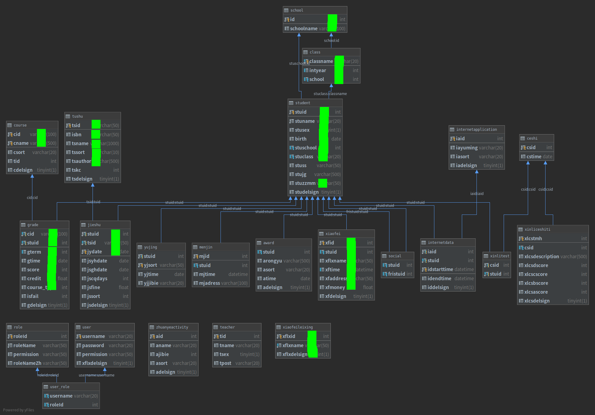

# 主页面

# 功能设计

如上图，教育系统主要有认证与授权、统计分析、指标计算和预警功能。具体功能描述如下：
## 认证与授权（已完成）
### 认证
使用教工号及密码进行登录，判断用户是否为合法用户。
### 授权
用户成功登陆后判断其权限，在其访问数据时基于其权限进行访问控制。
## 统计分析（部分完成，还未集成测试）
统计分析主要根据群体（学院、年级、班级）的学生数据，对其进行统计计算，如均值、方差、信息熵等，在浏览器页面中显示。
### 饼图
### 柱状图
### 折线图
### 能力分布图
### 词云等其他图
## 指标计算
## 预警功能
### 消费预警
### 毕业预警
### 健康预警
### 社交预警
# 指标计算模块（已完成行为熵的计算）
## 消费指数
学生消费指数 = 食堂消费/（校园网费*a+宿舍电费*b+超市消费*c+食堂消费）。
注：a、b、c均为系数。食堂消费占总消费比重越高，学生家庭越不富裕。
暂时取a = 20，b = 40，c = 10。

[恩格尔系数百度百科](https://baike.baidu.com/item/%E6%81%A9%E6%A0%BC%E5%B0%94%E7%B3%BB%E6%95%B0/528483?fr=aladdin#3)
## 行为熵

## 社交指数

## 偏科指数
偏科指数：用最差学科的名次除以最好学科的名次，如果全年级人数在1000名左右，则商大于20说明偏科偏到极高境界，在10~20之间属于偏科严重，1.5~10之间属于稍有偏科，1.5以下属于基本不偏科。

[参考文献](http://tieba.baidu.com/p/5550061687)
## 波动指数
成绩波动指数：用最差绩点的名次除以最好绩点的名次，其余同偏科指数。
## 科研实践能力
科研实践能力：获奖1*获奖级别+获奖2*获奖级别+..+论文1*论文级别+论文2*论文级别+...
## 健康指数
以月为计算单位  
健康指数 = a * 体育馆记录次数 - b * 行为熵 + c * 饮食多样度
饮食多样度 = 食堂消费记录熵（假设食堂消费数据存在窗口号，使用窗口号计算熵）
## 兴趣点
由借阅历史、上网记录、体育馆记录、选修课得出兴趣点，画词云。
# 图表设计
## 月消费总额变化趋势-折线图
## 月各消费地点消费比例-饼图
## 月消费总额变化趋势-折线图
## 必修挂科率变化趋势-折线图
## 必修挂科率科目比例-饼图
## 选修挂科率变化趋势-折线图
## 选修挂科率科目比例-饼图
## 绩点变化趋势-折线图
## 兴趣点-词云
## 选修课Top10类别-柱状图
## 借阅量Top10类别-柱状图
## 成绩熵的熵变化趋势-折线图
## 低分段Top10科目-柱状图
## 行为熵变化趋势-折线图
## 浏览量Top10类别-柱状图
# 预警（未开始）
## 消费预警
食堂消费总量/消费次数（每月），若总量少、次数多，则说明该学生在食堂吃的次数多，但是每次都很节俭，可能是学生家庭情况不是太好，故预警。
## 毕业预警
每名学生的每学期绩点。
## 健康预警
入学时、其他时间填写的心理问卷。
宿舍逗留时间。
朋友数（食堂、体育馆、图书馆共现）。
## 社交预警
朋友数（食堂、体育馆、图书馆共现）。
# 数据库设计（现有数据已全部导入）
数据库ER图如下：
其中，标绿色的列是数据库中已经导入的数据，其他数据缺失，所以暂时使用现存的数据进行开发。

# 技术栈
+ SpringBoot
+ Shiro
+ MyBatis
